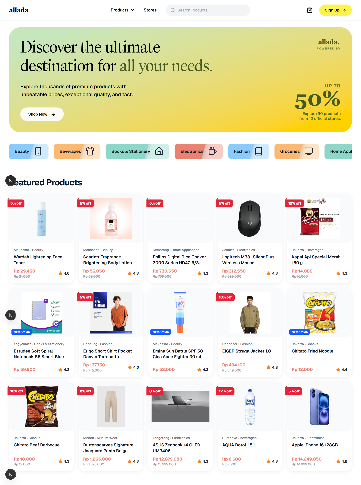

<h1 align="center">
  <a href="https://github.com/fatiya17/allada">
    <picture>
      <source media="(prefers-color-scheme: dark)" srcset="./public/icon-dark.svg">
      <source media="(prefers-color-scheme: light)" srcset="./public/icon-light.svg">
      
    </picture>
  </a>
</h1>

This is a modern e-commerce frontend I built for my hands-on task. You can browse products, filter categories, check out store profiles, and easily manage your shopping cart. 

Everything is designed to be clean, simple, and fast. Whether you're adding items to your cart or searching for products, the website feels snappy and smooth in your browser.

[](https://nextjs.org)
[](https://react.dev)
[](https://tailwindcss.com)
[](https://lucide.dev)
[](https://axios-http.com)

<br/>



## About The Project

**allada** is a simple but beautiful online store. It's built with Next.js App Router, making it incredibly fast. It connects to a live API, features a smart shopping cart, and keeps everything running smoothly using React Context.

## Brand Identity & Color Palette

We went with a clean, bright, and modern look. Here are the main colors we use:

| Role | Color Name | Hex Code | Preview |
|------|------------|----------|---------|
| **Primary (Brand)** | Bright Yellow | `#fcf350` |  |
| **Header Text** | Deep Moss Green | `#455a21` |  |
| **Background** | Pure White | `#ffffff` |  |
| **Hero Start** | Soft Pistachio | `#c6e6bd` |  |
| **Hero End** | Golden Yellow | `#fed201` |  |
| **Card Orange** | Warm Orange | `#fdb871` |  |
| **Card Coral** | Soft Coral | `#e98271` |  |
| **Card Teal** | Soft Teal | `#8dd7c8` |  |

**Typography:**
- **Primary Font:** `Geist Sans` (Clean, easy to read, perfect for UI)
- **Monospace Font:** `Geist Mono` (Used for smaller technical details)
- **Header/Logo Font:** `Calvino` (A heavy, elegant custom font for our brand)

## Key Features

### Beautiful UI
* **Clean Components:** Custom product cards and store profiles styled with Tailwind CSS.
* **Responsive Layout:** Looks perfect on your phone, tablet, and desktop.
* **Sticky Navigation:** A floating header so you can search or view your cart anytime.

### Shopping Experience
* **Smart Search & Filters:** Find exactly what you want by typing or clicking a category.
* **Cart Management:** Pick specific items to checkout, change quantities, and see the total price update instantly.
* **API Ready:** Fetches live data safely. If the internet drops, the app won't easily crash.

### User Account
* **Registration Form:** New users can create an account directly from the app using a clean registration form.
* **Email Verification:** After signing up, users receive an email verification step to confirm their identity before accessing their account.

## Data Source (API)

This app gets its live products and store data from this REST API:
- **Base URL:** `https://sistech-ecommerce-api.leficullen.xyz/api`

## How to Run Locally

1. **Download the code:**
   ```bash
   git clone https://github.com/fatiya17/allada.git
   cd allada
   ```

2. **Install packages:**
   ```bash
   npm install
   ```

3. **Start the app:**
   ```bash
   npm run dev
   ```

4. **Open in browser:**
   Go to `http://localhost:3000` to see it live!

---

## Credits & Authors

Made with ✨ by:

**Fatiya Labibah** - Web and Mobile Developer

*This project is a submission for the Hands-on 2 **SISTECH 2026** Portfolio Project (Frontend Engineer).*
